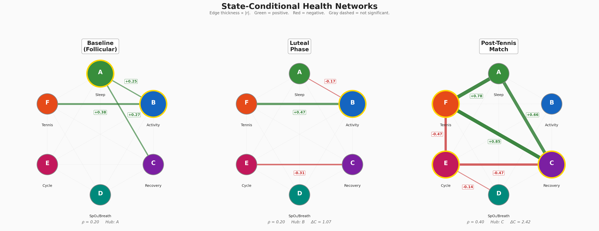

# Dynamic Health Networks from Wearable Data

A three-level framework for constructing state-conditional health networks from consumer wearable data. Applied to 7 months of Oura Ring data, the framework reveals how inter-metric dependency structures reorganize across physiological states.

**Paper:** *Dynamic Health Networks from Wearable Data: A Three-Level Framework* (SD4H Workshop @ ICML 2026)



## Key Findings

- **Hub rotation**: the dominant network hub shifts from Sleep (baseline) to Activity (luteal phase) to Recovery (post-tennis match)
- **Granger causality direction reversal**: Tennis Load drives Activity in the follicular phase; Activity constrains Tennis Load in the luteal phase — a volitional-to-capacity-limited mode shift
- **Post-tennis densification**: network density doubles (0.40 vs. 0.20) under acute exercise stress, with Recovery-Tennis coupling (r = +0.85) appearing exclusively post-match

## Framework

| Level | Method | Output |
|-------|--------|--------|
| **L1** | Lagged cross-correlation (lags 0–7 days) | Undirected weighted edges with permutation testing |
| **L2** | Granger causality (BIC-selected AR order) | Directed edges indicating temporal precedence |
| **L3** | State-conditional correlation matrices | Separate networks per body state with block bootstrap significance |

## Repository Structure

```
analysis/
  network_analysis.py      # L1, L2, L3 network computation
pipeline/
  process.py               # Raw JSON -> merged daily CSV
  annotations.py           # Tennis matches, travel periods, metadata
visualizations/
  results_viz.py           # Paper figures (state networks, hub centrality, edge heatmap)
  daily_metrics_viz.py     # Per-metric time series plots
  patterns_viz.py          # Cross-metric pattern visualizations
  weekly_monthly_viz.py    # Aggregated trend plots
fetch_heartrate.py         # Oura API heart rate data fetcher
```

## Data Pipeline

```
Oura API (raw JSON) --> pipeline/process.py --> daily_merged.csv --> analysis/network_analysis.py
                                                                          |
                                                                          v
                                                              network_results.json
                                                                          |
                                                                          v
                                                         visualizations/results_viz.py
```

## Network Nodes

| Node | Dimension | Source |
|------|-----------|-------|
| A | Sleep quality | Oura sleep score (0-100) |
| B | Daily activity | Oura activity score (0-100) |
| C | Recovery/stress | Oura readiness score (0-100) |
| D | Blood oxygen | z-scored SpO2 + inverted breathing disturbance |
| E | Menstrual cycle | Skin temperature deviation (continuous phase proxy) |
| F | Tennis load | Match indicator + workout peak HR + active calories |

## Body States

| State | N days | Identification |
|-------|--------|---------------|
| Baseline (Follicular) | 65 | Temp. deviation <= 0 C, no match flag |
| Luteal phase | 81 | Temp. deviation > 0 C sustained >= 3 days |
| Post-tennis match | 8 | Match day + 1 day after |

## Usage

### 1. Fetch data from Oura API

Set your Oura personal access token in `fetch_heartrate.py` and run:
```bash
python fetch_heartrate.py
```

### 2. Process raw data

```bash
python pipeline/process.py
```

### 3. Run network analysis

```bash
python analysis/network_analysis.py
```

### 4. Generate figures

```bash
python visualizations/results_viz.py
```

## Requirements

- Python 3.9+
- numpy, pandas, scipy, matplotlib
- Oura Ring Generation 3 (or any wearable producing daily health metrics)

## Adapting to Other Devices

The framework is device-agnostic. To apply it to Whoop, Garmin, Apple Watch, or other wearables:

1. Replace `pipeline/process.py` with your device's data loader
2. Map your metrics to the 6-node schema (or define your own nodes)
3. Define body states relevant to your participant in `pipeline/annotations.py`
4. Run `analysis/network_analysis.py` unchanged

## License

MIT
